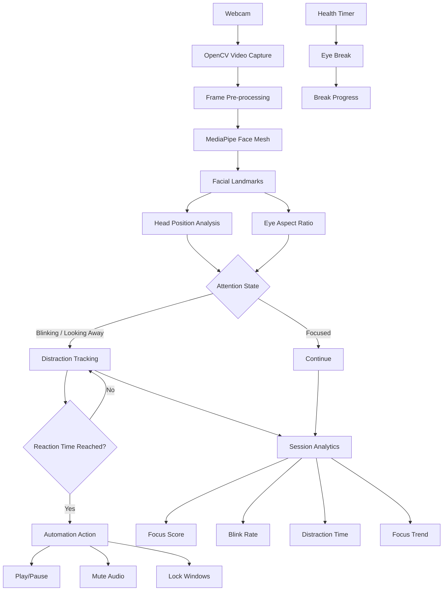

# FocusPauser Architecture

The README contains the primary Mermaid architecture diagram.

```mermaid
flowchart TD
    A[Webcam] --> B[OpenCV Video Capture]
    B --> C[Frame Pre-processing]
    C --> D[MediaPipe Face Mesh]
    D --> E[Facial Landmarks]
    E --> F[Head Position Analysis]
    E --> G[Eye Aspect Ratio]
    F --> H{Attention State}
    G --> H
    H -->|Focused| I[Continue]
    H -->|Blinking / Looking Away| J[Distraction Tracking]
    J --> K{Reaction Time Reached?}
    K -->|No| J
    K -->|Yes| L[Automation Action]
    L --> M[Play/Pause]
    L --> N[Mute Audio]
    L --> O[Lock Windows]
    J --> P[Session Analytics]
    I --> P
    P --> Q[Focus Score]
    P --> R[Blink Rate]
    P --> S[Distraction Time]
    P --> T[Focus Trend]
    U[Health Timer] --> V[Eye Break]
    V --> W[Break Progress]
```
