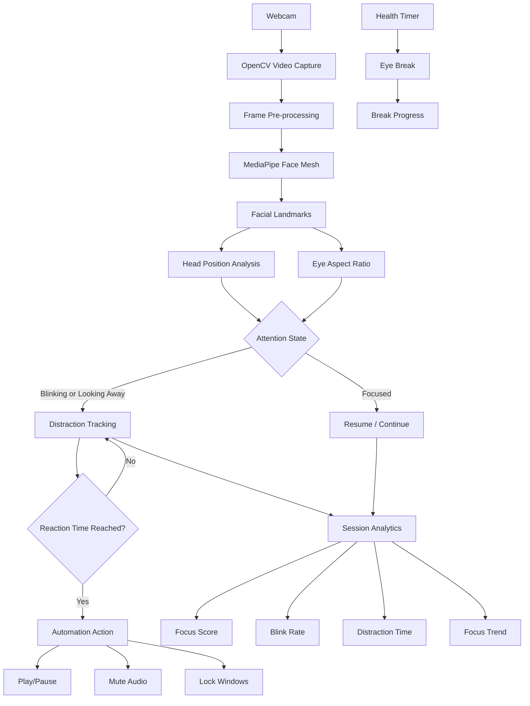

# FocusPauser 🎯

[](https://www.python.org/)
[](https://opencv.org/)
[](https://ai.google.dev/edge/mediapipe/solutions/guide)
[](https://customtkinter.tomschimansky.com/)
[](https://www.microsoft.com/windows)
[](#roadmap)
[](#license)

**FocusPauser** is a real-time attention monitoring desktop application built with Python, OpenCV, MediaPipe Face Mesh, and CustomTkinter.

It uses a webcam to estimate whether the user is focused, looking away, or blinking, then combines that information with configurable automation, live analytics, and eye-break reminders.

> **Note:** FocusPauser is a computer-vision productivity project, not a medical diagnostic system.

---


## 🎬 Demo


The demo should show the main workflow:

1. Launch FocusPauser.
2. Start a monitoring session.
3. Show the webcam detecting a focused state.
4. Look away to trigger the distraction state.
5. Demonstrate the configured action.
6. Return to the screen.
7. Open Analytics.
8. Show the mini widget and health-break functionality.

> Record the application locally and save the final recording as `demo.gif` in the repository root.

---

## ✨ Features

- 👁️ **Real-time attention monitoring** using webcam input
- 🧠 **MediaPipe Face Mesh** facial landmark tracking
- ↔️ **Head-turn detection**
- 👀 **Eye Aspect Ratio (EAR)** based eye-state detection
- 🎮 **Automatic actions** for distraction events
  - Play/Pause using `Space`
  - Mute audio
  - Lock Windows
- 📊 **Live analytics**
  - Focus score
  - Total session time
  - Distraction time
  - Blink rate
  - Focus trend
  - Focused vs. distracted time distribution
- 💚 **Eye-break protection** with configurable work/rest periods
- ⚡ **Strict, Normal, Relaxed, and Custom** tracking presets
- 🌓 **Dark, Light, and System** appearance modes
- 📷 **Selectable camera source**
- 🖥️ **Compact always-on-top mini widget**
- 🎨 Modern desktop UI using CustomTkinter
- 🔒 Local webcam processing in the current implementation

---

## 🧩 How It Works



---

## 🏗️ Architecture

FocusPauser follows a real-time event-driven architecture.

### 1. Video Input

OpenCV captures frames from the selected webcam.

### 2. Facial Landmark Detection

MediaPipe Face Mesh processes the RGB camera frame and returns facial landmarks.

### 3. Attention Estimation

The application combines:

- Nose/head position
- Eye landmarks
- Eye Aspect Ratio (EAR)

to determine the current attention state.

### 4. State Management

The application maintains states such as:

```text
FOCUSED
DISTRACTED
LOOKING_AWAY
BLINKING
BREAK_ACTIVE
STANDBY
```

### 5. Automation

When distraction persists beyond the configured reaction time, the selected system action is triggered.

### 6. Analytics

Session timing information is continuously accumulated and converted into:

- Focus score
- Distraction duration
- Blink rate
- Focus history
- Time distribution

### 7. User Interface

CustomTkinter provides the main application interface, while Matplotlib renders the analytics charts.

---

## 🔬 Attention Detection

### Head-Turn Detection

The current implementation compares the horizontal position of the nose landmark against the center of the camera frame.

A sufficiently large deviation is interpreted as looking away.

### Eye Aspect Ratio

The application calculates EAR using selected eye landmarks:

```text
EAR = (A + B) / (2 × C)
```

where `A` and `B` represent vertical eye distances and `C` represents horizontal eye distance.

A lower EAR indicates that the eye is more closed.

### Focus Score

The current focus score is based on the proportion of the session spent distracted:

```text
Focus Score =
100 - (Distracted Time / Total Session Time × 100)
```

The resulting value is constrained to the range `0–100`.

---

## ⌨️ Keyboard & Automation Actions

FocusPauser currently does **not** define a traditional set of user-facing keyboard shortcuts.

Instead, it can automatically send or perform system actions when a distraction condition is reached.

| Action | Behavior |
|---|---|
| `Space` | Sends the Space key through PyAutoGUI |
| Mute Audio | Toggles system mute |
| Lock Windows | Locks the Windows workstation |

The action and reaction time can be selected from **Settings**.

---

## 💚 Eye Break System

FocusPauser includes configurable eye-break protection inspired by the **20-20-20 rule**.

Users can configure:

- Focus/work duration
- Required rest duration
- Break reminders

When the configured work period is reached, the application enters break mode and tracks the required looking-away time.

---

## 📊 Analytics

During an active session, FocusPauser displays:

| Metric | Description |
|---|---|
| Focus Score | Estimated percentage of the session spent focused |
| Total Time | Duration of the current session |
| Distraction Time | Accumulated distracted time |
| Blink Rate | Estimated blinks per minute |
| Time Distribution | Focused vs. distracted time |
| Focus Trend | Focus score recorded throughout the session |

---

## ⚙️ Tracking Presets

| Preset | Eye Threshold | Head Threshold | Reaction Time |
|---|---:|---:|---:|
| Strict Focus | 0.26 | 40 | 1 second |
| Normal Mode | 0.23 | 60 | 2 seconds |
| Relaxed Watch | 0.18 | 100 | 5 seconds |
| Custom | User-defined | User-defined | User-defined |

These are the defaults implemented in the current version.

---

## 🛠️ Technology Stack

| Technology | Purpose |
|---|---|
| Python | Application logic |
| OpenCV | Webcam and image processing |
| MediaPipe | Facial landmark detection |
| NumPy | Numerical calculations |
| PyAutoGUI | Keyboard automation |
| CustomTkinter | Modern desktop interface |
| Tkinter | Base GUI functionality |
| Pillow | Image processing and rendering |
| Matplotlib | Analytics visualization |
| ctypes | Windows system integration |
| winsound | Windows notification sounds |

---

## 📋 Requirements

### Hardware

- Windows PC
- Working webcam
- Keyboard and mouse
- Recommended: reasonably good lighting

### Software

- Python **3.10 or newer**
- Windows operating system
- Webcam permissions enabled

Install the Python dependencies with:

```bash
pip install -r requirements.txt
```

---

## 🚀 Installation

### 1. Clone the repository

```bash
git clone https://github.com/YOUR_USERNAME/FocusPauser.git
cd FocusPauser
```

### 2. Create a virtual environment

```bash
python -m venv .venv
```

### 3. Activate the environment

Windows Command Prompt:

```cmd
.venv\Scripts\activate
```

PowerShell:

```powershell
.\.venv\Scripts\Activate.ps1
```

### 4. Install dependencies

```bash
python -m pip install --upgrade pip
pip install -r requirements.txt
```

### 5. Run

If your main file is named `main.py`:

```bash
python main.py
```

---

## 📁 Recommended Repository Structure

```text
FocusPauser/
│
├── FocusPauser.py
├── README.md
├── requirements.txt
├── .gitignore
├── LICENSE

```

---

## 🧪 Current Limitations

- Attention estimation depends on webcam position and lighting.
- Head direction is currently approximated using facial landmark position.
- Blinks can be interpreted as a temporary distracted state.
- Different users may require different sensitivity thresholds.
- Long-term session history is not currently stored.
- The current implementation is primarily Windows-oriented.
- The project uses threshold-based attention logic rather than training a custom classifier.
- A webcam is required for real-time monitoring.

---

## 🔮 Roadmap

Planned improvements include:

- [ ] Full 3D head-pose estimation
- [ ] Improved gaze tracking
- [ ] User-specific calibration
- [ ] Better blink vs. distraction classification
- [ ] Persistent session history
- [ ] Daily/weekly/monthly productivity reports
- [ ] More automation integrations
- [ ] Cross-platform support
- [ ] Modular project architecture
- [ ] Optional machine-learning-based attention classification
- [ ] Desktop notifications
- [ ] Packaging as a standalone Windows application

---

## 📚 What I Learned

Building FocusPauser provided practical experience with:

### Computer Vision
- Real-time webcam processing
- Facial landmark detection
- Eye Aspect Ratio calculations
- Head-position analysis
- Image conversion and rendering

### AI Integration
The project demonstrates how a pre-trained computer-vision model can be integrated into a practical software application without training a new model from scratch.

### GUI Development
- CustomTkinter
- Tkinter event handling
- Dynamic widgets
- Tabs and dashboards
- Real-time UI updates

### Real-Time Programming
- Continuous frame processing
- Application state management
- Timers
- Event-driven programming
- Camera resource management

### Data Visualization
- Real-time metric calculation
- Matplotlib charts
- Focus trend visualization

### System Automation
- Keyboard automation
- System audio control
- Windows workstation locking

---

## 🔐 Privacy

The current application processes webcam frames locally within the application and does not implement an external server for uploading camera footage.

Because webcam access is involved, users should review the source code and configure operating-system camera permissions appropriately.

---

## 🤝 Contributing

Contributions are welcome.

A typical workflow is:

```bash
git checkout -b feature/your-feature
```

Make your changes, test them locally, then commit:

```bash
git add .
git commit -m "Add your feature"
git push origin feature/your-feature
```

Open a Pull Request describing the change.

---

## 📄 License

This project is intended to use the **MIT License**.

See [`LICENSE`](LICENSE) for the full license text.

---

## 👨‍💻 Author

**Bennet Varghese Reji**

B.Tech Computer Science & Engineering

---

<p align="center">
  Built with Python, Computer Vision, and a webcam.
</p>
